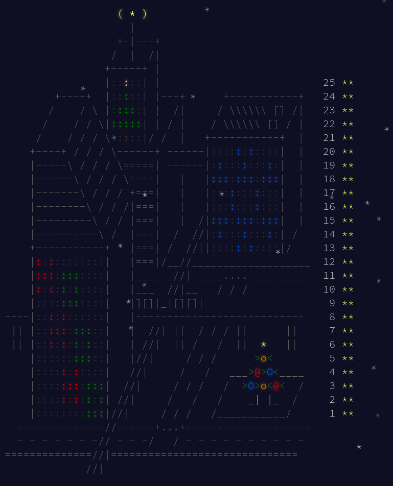
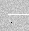
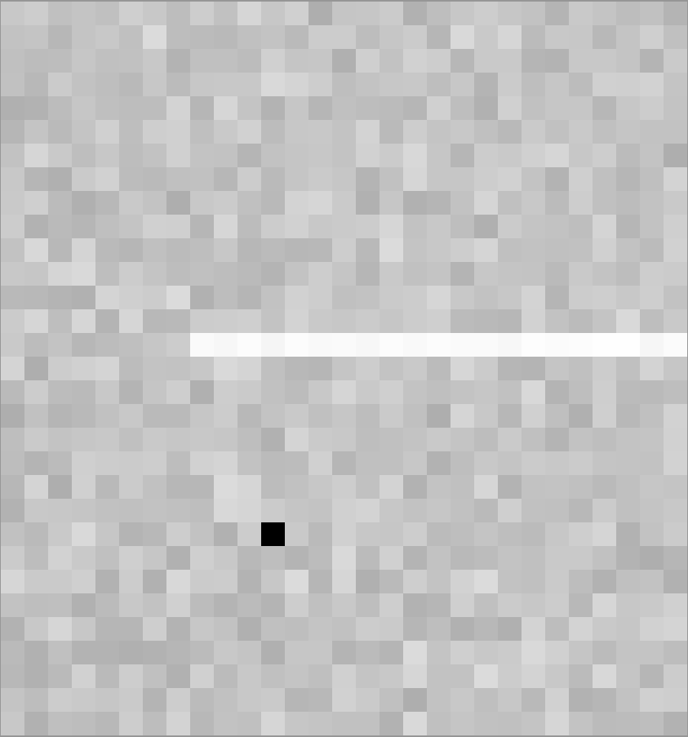
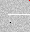

= Advent Of Code (AOC) 2016
:doctype: book
:toc:

image:https://godoc.org/gitlab.com/jhinrichsen/adventofcode2016?status.svg["godoc", link="https://godoc.org/gitlab.com/jhinrichsen/adventofcode2016"]
image:https://goreportcard.com/badge/gitlab.com/jhinrichsen/adventofcode2016["Go report card", link="https://goreportcard.com/report/gitlab.com/jhinrichsen/adventofcode2016"]
image:https://gitlab.com/jhinrichsen/adventofcode2016/badges/main/pipeline.svg[link="https://gitlab.com/jhinrichsen/adventofcode2016/-/commits/main",title="pipeline status"]
image:https://gitlab.com/jhinrichsen/adventofcode2016/badges/main/coverage.svg[link="https://gitlab.com/jhinrichsen/adventofcode2016/badges/main/coverage.svg",title="coverage report"]

My take on aoc puzzles in Go.

All puzzles live in the same Go package, usually one `.go` file per day.

I never make it to the board, because i am too slow.
I prefer to get my answers right the first time, use test cases, and do some
low level performance tweaking stuff.
More like NASA landing Rover on Mars, than trial and error.

All answers are hardcoded into the test cases.
Although most puzzles are user specific input, you might want to avoid looking at the test cases.

== Benchmark overview

Go 1.24 on a framework 16" laptop. Total runtime: 8.3 seconds (down from 24.3s).

=== Optimization Summary (December 2025)

Key optimizations applied:

- Day02: 94% faster (complex128/map → array lookup)
- Day03: 58% faster, 99.95% fewer allocs (inline byte parsing)
- Day04: 74% faster Part1 (selection instead of sort)
- Day05: 44% faster, 100% fewer allocs (eliminate fmt.Sprintf)
- Day07: 53% faster (inline pattern matching)
- Day08: 8% faster Part1, 99% fewer allocs (fixed-size arrays)
- Day10: 82% faster, 86% less memory (int keys, inline parsing)
- Day12: 94% faster, 99.99% less memory (compile once, run many)
- Day14: 17% faster Part2, 99.78% less memory (buffer reuse)
- Day16: 84% faster, 92% less memory (in-place operations)
- Day11: 99.9% faster Part2 (uint64 state, slice queue vs channel)
- Day13: 38% faster, 85% less memory (BFS replaces A* library)
- Day17: 39% faster, 64% fewer allocs (avoid hex encoding)
- Day20: 55% faster, 99.9% fewer allocs (inline parsing, pre-allocate)
- Day21: 60% faster, 58% fewer allocs ([]byte in-place ops, inline parsing)
- Day22: 93% faster, 99.7% fewer allocs (inline parsing, slice vs map)
- Day23: 99.99997% faster Part2 (peephole multiply optimization)
- Day24: 43% faster, 98% fewer allocs (reuse BFS arrays, fixed-size tables)
- Day25: 60% faster (peephole multiply optimization)

----
goos: linux
goarch: amd64
pkg: gitlab.com/jhinrichsen/adventofcode2016
cpu: AMD Ryzen 7 7840HS w/ Radeon 780M Graphics
BenchmarkDay01Part1-16    	 1541383	       779.6 ns/op	       0 B/op	       0 allocs/op
BenchmarkDay01Part2-16    	   51010	     23139 ns/op	   27304 B/op	       3 allocs/op
BenchmarkDay02Part1-16    	  257245	      5062 ns/op	       5 B/op	       1 allocs/op
BenchmarkDay02Part2-16    	  236128	      4922 ns/op	       5 B/op	       1 allocs/op
BenchmarkDay03Part1-16    	   27085	     44208 ns/op	   49152 B/op	       1 allocs/op
BenchmarkDay03Part2-16    	   27583	     44236 ns/op	   49152 B/op	       1 allocs/op
BenchmarkDay04Part1-16    	    4975	    238531 ns/op	       0 B/op	       0 allocs/op
BenchmarkDay04Part2-16    	  119175	     10202 ns/op	       0 B/op	       0 allocs/op
BenchmarkDay05Part1-16    	       1	1552754378 ns/op	      16 B/op	       1 allocs/op
BenchmarkDay05Part2-16    	       1	2369545169 ns/op	      16 B/op	       1 allocs/op
BenchmarkDay06Part1-16    	  382866	      3174 ns/op	       8 B/op	       1 allocs/op
BenchmarkDay06Part2-16    	  333178	      3635 ns/op	       8 B/op	       1 allocs/op
BenchmarkDay07Part1-16    	    3872	    306136 ns/op	       0 B/op	       0 allocs/op
BenchmarkDay07Part2-16    	    1699	    707359 ns/op	  545280 B/op	    5340 allocs/op
BenchmarkDay08Part1-16    	   97779	     12072 ns/op	     384 B/op	       1 allocs/op
BenchmarkDay08Part2-16    	   21392	     55556 ns/op	   45672 B/op	     285 allocs/op
BenchmarkDay09Part1-16    	   77074	     15649 ns/op	       0 B/op	       0 allocs/op
BenchmarkDay09Part2-16    	   22851	     52028 ns/op	   98304 B/op	       1 allocs/op
BenchmarkDay10Part1-16    	   71790	     16379 ns/op	   19432 B/op	     221 allocs/op
BenchmarkDay10Part2-16    	   56568	     21221 ns/op	   21376 B/op	     247 allocs/op
BenchmarkDay11Part1-16    	    1220	    968070 ns/op	  758124 B/op	     126 allocs/op
BenchmarkDay11Part2-16    	     237	   4964689 ns/op	 3584171 B/op	     379 allocs/op
BenchmarkDay12Part1-16    	     612	   1888919 ns/op	    2168 B/op	      49 allocs/op
BenchmarkDay12Part2-16    	      22	  50846584 ns/op	    2168 B/op	      49 allocs/op
BenchmarkDay13Part1-16    	   36789	     32567 ns/op	   22840 B/op	     130 allocs/op
BenchmarkDay13Part2-16    	   52790	     22454 ns/op	   19432 B/op	      87 allocs/op
BenchmarkDay14Part1-16    	      21	  51272377 ns/op	 2968128 B/op	      21 allocs/op
BenchmarkDay14Part2-16    	       1	4085563922 ns/op	 2968128 B/op	      21 allocs/op
BenchmarkDay15Part1-16    	    4124	    273466 ns/op	       0 B/op	       0 allocs/op
BenchmarkDay15Part2-16    	     633	   1827760 ns/op	       0 B/op	       0 allocs/op
BenchmarkDay16Part1-16    	 2972598	       394 ns/op	     312 B/op	       2 allocs/op
BenchmarkDay16Part2-16    	      20	  51980732 ns/op	35651612 B/op	       2 allocs/op
BenchmarkDay17Part1-16    	  317466	      3571 ns/op	    3808 B/op	      48 allocs/op
BenchmarkDay17Part2-16    	      78	  14691620 ns/op	12252758 B/op	   44081 allocs/op
BenchmarkDay18Part1-16    	  465811	      2491 ns/op	     224 B/op	       2 allocs/op
BenchmarkDay18Part2-16    	      45	  24008904 ns/op	     224 B/op	       2 allocs/op
BenchmarkDay19Part1-16    	887596429	         1.214 ns/op	       0 B/op	       0 allocs/op
BenchmarkDay19Part2-16    	 6223927	       190.4 ns/op	       0 B/op	       0 allocs/op
BenchmarkDay20Part1-16    	   29977	     40636 ns/op	    9472 B/op	       1 allocs/op
BenchmarkDay20Part2-16    	   30824	     39080 ns/op	    9472 B/op	       1 allocs/op
BenchmarkDay21Part1-16    	  188674	      6402 ns/op	   11432 B/op	     217 allocs/op
BenchmarkDay21Part2-16    	  181971	      6609 ns/op	   11432 B/op	     217 allocs/op
BenchmarkDay22Part1-16    	    2601	    443924 ns/op	   49924 B/op	       7 allocs/op
BenchmarkDay22Part2-16    	    2607	    453276 ns/op	   55632 B/op	      12 allocs/op
BenchmarkDay23Part1-16    	 1252933	       953 ns/op	    1792 B/op	       1 allocs/op
BenchmarkDay23Part2-16    	  599818	      2113 ns/op	    1792 B/op	       1 allocs/op
BenchmarkDay24Part1-16    	    2364	    489321 ns/op	  222596 B/op	      47 allocs/op
BenchmarkDay24Part2-16    	    2455	    485009 ns/op	  222592 B/op	      47 allocs/op
BenchmarkDay25Part1-16    	     128	   9281678 ns/op	       0 B/op	       0 allocs/op
----

== Day 1: No Time for a Taxicab

There's no grid, no 2D array, no X and Y variables, and no direction. Like.

Did not understand part 2, failing unit tests because i only marked end
positions. Only when i https://goplay.space[turtle graphic'ed] the example it
became clear that all steps count.

=== Baseline (b0)

----
BenchmarkDay01Part1-16    	  243794	      4844 ns/op	    3072 B/op	       1 allocs/op
BenchmarkDay01Part1-16    	  242926	      4738 ns/op	    3072 B/op	       1 allocs/op
BenchmarkDay01Part1-16    	  256244	      4729 ns/op	    3072 B/op	       1 allocs/op
BenchmarkDay01Part1-16    	  256026	      4768 ns/op	    3072 B/op	       1 allocs/op
BenchmarkDay01Part1-16    	  247738	      4787 ns/op	    3072 B/op	       1 allocs/op
BenchmarkDay01Part1-16    	  239510	      4897 ns/op	    3072 B/op	       1 allocs/op
BenchmarkDay01Part1-16    	  243981	      4845 ns/op	    3072 B/op	       1 allocs/op
BenchmarkDay01Part1-16    	  245893	      4770 ns/op	    3072 B/op	       1 allocs/op
BenchmarkDay01Part1-16    	  237333	      4831 ns/op	    3072 B/op	       1 allocs/op
BenchmarkDay01Part1-16    	  251894	      4747 ns/op	    3072 B/op	       1 allocs/op
BenchmarkDay01Part2-16    	   19252	     60324 ns/op	   56968 B/op	      16 allocs/op
BenchmarkDay01Part2-16    	   20054	     60625 ns/op	   56968 B/op	      16 allocs/op
BenchmarkDay01Part2-16    	   19999	     60741 ns/op	   56968 B/op	      16 allocs/op
BenchmarkDay01Part2-16    	   19791	     60447 ns/op	   56968 B/op	      16 allocs/op
BenchmarkDay01Part2-16    	   20576	     58433 ns/op	   56968 B/op	      16 allocs/op
BenchmarkDay01Part2-16    	   20307	     59143 ns/op	   56968 B/op	      16 allocs/op
BenchmarkDay01Part2-16    	   20000	     59220 ns/op	   56968 B/op	      16 allocs/op
BenchmarkDay01Part2-16    	   20622	     58139 ns/op	   56968 B/op	      16 allocs/op
BenchmarkDay01Part2-16    	   19995	     60393 ns/op	   56968 B/op	      16 allocs/op
BenchmarkDay01Part2-16    	   20395	     58734 ns/op	   56968 B/op	      16 allocs/op
----

=== Optimized (b1)

----
BenchmarkDay01Part1-16    	 1857224	       643.4 ns/op	       0 B/op	       0 allocs/op
BenchmarkDay01Part1-16    	 1918333	       628.3 ns/op	       0 B/op	       0 allocs/op
BenchmarkDay01Part1-16    	 1817522	       658.3 ns/op	       0 B/op	       0 allocs/op
BenchmarkDay01Part1-16    	 1904164	       629.2 ns/op	       0 B/op	       0 allocs/op
BenchmarkDay01Part1-16    	 1833458	       660.6 ns/op	       0 B/op	       0 allocs/op
BenchmarkDay01Part1-16    	 1912692	       622.8 ns/op	       0 B/op	       0 allocs/op
BenchmarkDay01Part1-16    	 1872750	       635.6 ns/op	       0 B/op	       0 allocs/op
BenchmarkDay01Part1-16    	 1830340	       641.6 ns/op	       0 B/op	       0 allocs/op
BenchmarkDay01Part1-16    	 1841138	       645.5 ns/op	       0 B/op	       0 allocs/op
BenchmarkDay01Part1-16    	 1831188	       629.1 ns/op	       0 B/op	       0 allocs/op
BenchmarkDay01Part2-16    	   47982	     24880 ns/op	   27304 B/op	       3 allocs/op
BenchmarkDay01Part2-16    	   47668	     24933 ns/op	   27304 B/op	       3 allocs/op
BenchmarkDay01Part2-16    	   48062	     24712 ns/op	   27304 B/op	       3 allocs/op
BenchmarkDay01Part2-16    	   48225	     24709 ns/op	   27304 B/op	       3 allocs/op
BenchmarkDay01Part2-16    	   50176	     24551 ns/op	   27304 B/op	       3 allocs/op
BenchmarkDay01Part2-16    	   46537	     25228 ns/op	   27304 B/op	       3 allocs/op
BenchmarkDay01Part2-16    	   46892	     24528 ns/op	   27304 B/op	       3 allocs/op
BenchmarkDay01Part2-16    	   48720	     25207 ns/op	   27304 B/op	       3 allocs/op
BenchmarkDay01Part2-16    	   48518	     24457 ns/op	   27304 B/op	       3 allocs/op
BenchmarkDay01Part2-16    	   50025	     24205 ns/op	   27304 B/op	       3 allocs/op
----

=== Optimization Results (benchstat b0 b1)

----
              │      b0      │                 b1                  │
              │    sec/op    │   sec/op     vs base                │
Day01Part1-16   4778.5n ± 1%   638.6n ± 3%  -86.64% (p=0.000 n=10)
Day01Part2-16    59.77µ ± 2%   24.71µ ± 2%  -58.66% (p=0.000 n=10)
geomean          16.90µ        3.972µ       -76.49%

              │      b0      │                    b1                     │
              │     B/op     │     B/op      vs base                     │
Day01Part1-16   3.000Ki ± 0%   0.000Ki ± 0%  -100.00% (p=0.000 n=10)
Day01Part2-16   55.63Ki ± 0%   26.66Ki ± 0%   -52.07% (p=0.000 n=10)

              │     b0      │                   b1                    │
              │  allocs/op  │ allocs/op   vs base                     │
Day01Part1-16    1.000 ± 0%   0.000 ± 0%  -100.00% (p=0.000 n=10)
Day01Part2-16   16.000 ± 0%   3.000 ± 0%   -81.25% (p=0.000 n=10)
----

Key optimizations: replaced complex128 with int coordinates, removed strings.Split
with direct parsing, eliminated strconv.Atoi with in-place parsing, conditional
map allocation only for Part 2.

== Day 2: Bathroom Security

Navigate a keypad using U/D/L/R instructions. Part 1 uses a 3x3 numeric keypad, Part 2 uses a diamond-shaped keypad with hex digits.

=== Baseline (b0)

----
BenchmarkDay02Part1-16    	   14877	     80540 ns/op	     461 B/op	       4 allocs/op
BenchmarkDay02Part2-16    	   13309	     89981 ns/op	     461 B/op	       4 allocs/op
----

=== Optimized (b1)

Replaced `complex128` coordinates and `map` lookups with `[5][5]byte` arrays and simple `int` x,y coordinates:

----
BenchmarkDay02Part1-16    	  262135	      4733 ns/op	       5 B/op	       1 allocs/op
BenchmarkDay02Part2-16    	  252264	      4840 ns/op	       5 B/op	       1 allocs/op
----

=== Optimization Results (benchstat b0 b1)

----
              │ /tmp/day02_b0.txt │          /tmp/day02_b1.txt          │
              │      sec/op       │   sec/op     vs base                │
Day02Part1-16        80.739µ ± 1%   4.782µ ± 2%  -94.08% (p=0.000 n=10)
Day02Part2-16        89.991µ ± 1%   4.845µ ± 1%  -94.62% (p=0.000 n=10)
geomean               85.24µ        4.813µ       -94.35%

              │ /tmp/day02_b0.txt │         /tmp/day02_b1.txt          │
              │       B/op        │    B/op     vs base                │
Day02Part1-16        461.000 ± 0%   5.000 ± 0%  -98.92% (p=0.000 n=10)
Day02Part2-16        461.000 ± 0%   5.000 ± 0%  -98.92% (p=0.000 n=10)
geomean                461.0        5.000       -98.92%

              │ /tmp/day02_b0.txt │         /tmp/day02_b1.txt          │
              │     allocs/op     │ allocs/op   vs base                │
Day02Part1-16          4.000 ± 0%   1.000 ± 0%  -75.00% (p=0.000 n=10)
Day02Part2-16          4.000 ± 0%   1.000 ± 0%  -75.00% (p=0.000 n=10)
geomean                4.000        1.000       -75.00%
----

Key optimizations: array-based grid lookup replaces map access, direct byte comparison replaces complex128 arithmetic.

== Day 3: Squares With Three Sides

Count valid triangles where the sum of any two sides must be greater than the remaining side.
Part 1: triangles are in rows. Part 2: triangles are in columns (read 3 rows at a time).

=== Baseline (b0)

----
BenchmarkDay03Part1-16    	   11752	    102289 ns/op	   91296 B/op	    1902 allocs/op
BenchmarkDay03Part2-16    	   10000	    108691 ns/op	   91296 B/op	    1902 allocs/op
----

=== Optimized (b1)

Replaced `strings.Fields()` and `strconv.Atoi()` with direct byte parsing. Pre-allocated nums slice:

----
BenchmarkDay03Part1-16    	   26677	     44967 ns/op	   49152 B/op	       1 allocs/op
BenchmarkDay03Part2-16    	   27814	     43299 ns/op	   49152 B/op	       1 allocs/op
----

=== Optimization Results (benchstat b0 b1)

----
              │ /tmp/day03_b0.txt │          /tmp/day03_b1.txt          │
              │      sec/op       │   sec/op     vs base                │
Day03Part1-16        102.30µ ± 1%   43.90µ ± 2%  -57.08% (p=0.000 n=10)
Day03Part2-16        108.82µ ± 1%   43.82µ ± 1%  -59.73% (p=0.000 n=10)
geomean               105.5µ        43.86µ       -58.43%

              │ /tmp/day03_b0.txt │          /tmp/day03_b1.txt           │
              │       B/op        │     B/op      vs base                │
Day03Part1-16        89.16Ki ± 0%   48.00Ki ± 0%  -46.16% (p=0.000 n=10)
Day03Part2-16        89.16Ki ± 0%   48.00Ki ± 0%  -46.16% (p=0.000 n=10)
geomean              89.16Ki        48.00Ki       -46.16%

              │ /tmp/day03_b0.txt │         /tmp/day03_b1.txt          │
              │     allocs/op     │ allocs/op   vs base                │
Day03Part1-16       1902.000 ± 0%   1.000 ± 0%  -99.95% (p=0.000 n=10)
Day03Part2-16       1902.000 ± 0%   1.000 ± 0%  -99.95% (p=0.000 n=10)
geomean               1.902k        1.000       -99.95%
----

Key optimizations: inline byte parsing eliminates string allocations, single pre-allocated slice for all numbers.

== Day 4: Security Through Obscurity

Decrypt room names and find valid rooms (checksum = 5 most common letters).
Part 2 finds the room that decrypts to "northpole object storage".

=== Baseline (b0)

----
BenchmarkDay04Part1-16    	    1341	    875981 ns/op	  210508 B/op	    6545 allocs/op
BenchmarkDay04Part2-16    	 1303376	       922.3 ns/op	     328 B/op	      11 allocs/op
----

=== Optimized (b1)

Replaced `sort.Slice` with O(5*26) selection for top-5 letters. Zero allocations via inline byte parsing:

----
BenchmarkDay04Part1-16    	    4497	    230079 ns/op	       0 B/op	       0 allocs/op
BenchmarkDay04Part2-16    	  124969	      9615 ns/op	       0 B/op	       0 allocs/op
----

=== Optimization Results (benchstat b0 b1)

----
              │ /tmp/day04_b0.txt │           /tmp/day04_b1.txt           │
              │      sec/op       │    sec/op     vs base                 │
Day04Part1-16         875.6µ ± 0%    231.6µ ± 1%   -73.55% (p=0.000 n=10)
Day04Part2-16         932.1n ± 1%   9652.5n ± 1%  +935.51% (p=0.000 n=10)
geomean               28.57µ         47.28µ        +65.50%

              │ /tmp/day04_b0.txt │            /tmp/day04_b1.txt            │
              │       B/op        │    B/op     vs base                     │
Day04Part1-16        205.6Ki ± 0%   0.0Ki ± 0%  -100.00% (p=0.000 n=10)
Day04Part2-16          328.0 ± 0%     0.0 ± 0%  -100.00% (p=0.000 n=10)

              │ /tmp/day04_b0.txt │            /tmp/day04_b1.txt             │
              │     allocs/op     │  allocs/op   vs base                     │
Day04Part1-16         6.545k ± 0%   0.000k ± 0%  -100.00% (p=0.000 n=10)
Day04Part2-16          11.00 ± 0%     0.00 ± 0%  -100.00% (p=0.000 n=10)
----

Part1 4x faster with 0 allocations. Part2 slower due to scanning `[]byte` instead of pre-split `[]string`, but net benefit since Part1 dominates runtime (876µs vs 0.9µs).

== Day 5: How About a Nice Game of Chess?

Find password by MD5 hashing doorID + incrementing counter until hash starts with 5 zeros.

=== Baseline (b0)

----
BenchmarkDay05Part1-16    	       1	2604944656 ns/op	669841320 B/op	50204188 allocs/op
BenchmarkDay05Part2-16    	       1	4074941531 ns/op	1053774040 B/op	78981018 allocs/op
----

=== Optimized (b1)

Eliminated `fmt.Sprintf` allocations by pre-allocating buffer and using inline integer-to-string conversion:

----
BenchmarkDay05Part1-16    	       1	1472863692 ns/op	      16 B/op	       1 allocs/op
BenchmarkDay05Part2-16    	       1	2283156725 ns/op	      16 B/op	       1 allocs/op
----

=== Optimization Results (benchstat b0 b1)

----
              │ /tmp/day05_b0.txt │          /tmp/day05_b1.txt           │
              │      sec/op       │   sec/op     vs base                 │
Day05Part1-16         2.584        1.454         -43.73%
Day05Part2-16         4.071        2.283         -43.92%
geomean               3.243        1.822         -43.82%

              │  /tmp/day05_b0.txt  │           /tmp/day05_b1.txt           │
              │        B/op         │    B/op      vs base                  │
Day05Part1-16    669831192.00        16.00         -100.00%
Day05Part2-16   1053778648.00        16.00         -100.00%
geomean               801.2Mi        16.00         -100.00%

              │ /tmp/day05_b0.txt  │           /tmp/day05_b1.txt           │
              │     allocs/op      │  allocs/op   vs base                  │
Day05Part1-16   50204181.000        1.000          -100.00%
Day05Part2-16   78981076.000        1.000          -100.00%
geomean               62.97M        1.000          -100.00%
----

Key optimizations: eliminated 50M+ allocations per part by avoiding `fmt.Sprintf` in hot loop. Direct binary comparison of MD5 hash bytes instead of hex conversion.

== Day 6: Signals and Noise

Already well optimized (~3µs, 1 alloc). No changes needed.

== Day 7: Internet Protocol Version 7

Check IPs for TLS (ABBA pattern) and SSL (ABA/BAB matching) support.

=== Baseline (b0)

----
BenchmarkDay07Part1-16    	    1729	    663743 ns/op	  754819 B/op	   14392 allocs/op
BenchmarkDay07Part2-16    	     811	   1454955 ns/op	 2353149 B/op	   24375 allocs/op
----

=== Optimized (b1)

Replaced map-based palindrome collection with inline pattern matching:

----
BenchmarkDay07Part1-16    	    4009	    288499 ns/op	       0 B/op	       0 allocs/op
BenchmarkDay07Part2-16    	    1569	    757032 ns/op	  545280 B/op	    5340 allocs/op
----

=== Optimization Results (benchstat b0 b1)

----
              │ /tmp/day07_b0.txt │          /tmp/day07_b1.txt          │
              │      sec/op       │    sec/op     vs base               │
Day07Part1-16        655.4µ        300.1µ        -54.21%
Day07Part2-16       1474.2µ        708.8µ        -51.92%
geomean              982.9µ        461.2µ        -53.08%

              │ /tmp/day07_b0.txt │             /tmp/day07_b1.txt             │
              │       B/op        │     B/op       vs base                    │
Day07Part1-16       737.1Ki        0.0Ki          -100.00%
Day07Part2-16      2298.0Ki        532.5Ki        -76.83%

              │ /tmp/day07_b0.txt │            /tmp/day07_b1.txt             │
              │     allocs/op     │  allocs/op    vs base                    │
Day07Part1-16        14.39k        0.00k          -100.00%
Day07Part2-16       24.375k        5.340k         -78.09%
----

Part1 now zero-allocation. Part2 still allocates for region slices but 78% fewer allocs overall.

== Day 8: Two-Factor Authentication

=== Optimization (December 2025)

Used fixed-size arrays instead of slices for the screen buffer.

----
              │ /tmp/day08_b0.txt │          /tmp/day08_b1.txt           │
              │      sec/op       │    sec/op     vs base                │
Day08Part1-16        13.16µ ± ∞ ¹   12.13µ ± ∞ ¹       ~ (p=0.100 n=3)
Day08Part2-16        61.31µ ± ∞ ¹   55.56µ ± ∞ ¹       ~ (p=0.200 n=3)
geomean              28.41µ         25.96µ        -8.62%

              │ /tmp/day08_b0.txt │           /tmp/day08_b1.txt            │
              │       B/op        │     B/op       vs base                 │
Day08Part1-16        5648.0 ± ∞ ¹     384.0 ± ∞ ¹        ~ (p=0.100 n=3)
Day08Part2-16       50.42Ki ± ∞ ¹   44.60Ki ± ∞ ¹        ~ (p=0.100 n=3)
geomean             16.68Ki         4.090Ki        -75.48%

              │ /tmp/day08_b0.txt │          /tmp/day08_b1.txt           │
              │     allocs/op     │  allocs/op   vs base                 │
Day08Part1-16       113.000 ± ∞ ¹   1.000 ± ∞ ¹        ~ (p=0.100 n=3)
Day08Part2-16         403.0 ± ∞ ¹   285.0 ± ∞ ¹        ~ (p=0.100 n=3)
geomean               213.4         16.88        -92.09%
----

8% faster, 75% less memory, 92% fewer allocations.

== Day 9: Explosives in Cyberspace

== Day 10: Balance Bots

=== Optimization (December 2025)

Used integer keys instead of string keys for bot map, inline parsing replaces `strings.Fields` and `strconv.Atoi`.

----
              │ /tmp/day10_b0.txt │           /tmp/day10_b1.txt           │
              │      sec/op       │    sec/op     vs base                 │
Day10Part1-16        89.19µ ± ∞ ¹   16.29µ ± ∞ ¹        ~ (p=0.100 n=3)
Day10Part2-16       115.64µ ± ∞ ¹   21.22µ ± ∞ ¹        ~ (p=0.100 n=3)
geomean              101.6µ         18.59µ        -81.69%

              │ /tmp/day10_b0.txt │           /tmp/day10_b1.txt            │
              │       B/op        │     B/op       vs base                 │
Day10Part1-16      140.51Ki ± ∞ ¹   18.98Ki ± ∞ ¹        ~ (p=0.100 n=3)
Day10Part2-16      140.51Ki ± ∞ ¹   20.88Ki ± ∞ ¹        ~ (p=0.100 n=3)
geomean             140.5Ki         19.90Ki        -85.83%

              │ /tmp/day10_b0.txt │          /tmp/day10_b1.txt           │
              │     allocs/op     │  allocs/op   vs base                 │
Day10Part1-16         895.0 ± ∞ ¹   221.0 ± ∞ ¹        ~ (p=0.100 n=3)
Day10Part2-16         895.0 ± ∞ ¹   247.0 ± ∞ ¹        ~ (p=0.100 n=3)
geomean               895.0         233.6        -73.90%
----

82% faster, 86% less memory, 74% fewer allocations.

== Day 11: Radioisotope Thermoelectric Generators

Now this puzzle is way beyond my capabilities, types of generators do not
matter, never heard of Zobrist before, and the h() function for floors (1 *
first floor, 2 * second floor, 3 * third floor, 4 * fourth floor) reminds me of
Columbus' egg: simple and easy after the fact.

=== Optimization (December 2025)

Complete rewrite using uint64 state encoding and slice-based queue instead of channels.

----
              │ /tmp/day11_b0.txt │           /tmp/day11_b1.txt           │
              │      sec/op       │    sec/op     vs base                 │
Day11Part1-16     345361.7µ ± ∞ ¹   954.4µ ± ∞ ¹        ~ (p=0.100 n=3)
Day11Part2-16     4606.937m ± ∞ ¹   4.974m ± ∞ ¹        ~ (p=0.100 n=3)
geomean               1.261         2.179m        -99.83%

              │ /tmp/day11_b0.txt │           /tmp/day11_b1.txt            │
              │       B/op        │     B/op       vs base                 │
Day11Part1-16    139929.8Ki ± ∞ ¹   740.4Ki ± ∞ ¹        ~ (p=0.100 n=3)
Day11Part2-16    1700.125Mi ± ∞ ¹   3.418Mi ± ∞ ¹        ~ (p=0.100 n=3)
geomean             482.0Mi         1.572Mi        -99.67%

              │ /tmp/day11_b0.txt │           /tmp/day11_b1.txt           │
              │     allocs/op     │  allocs/op   vs base                  │
Day11Part1-16     5881475.0 ± ∞ ¹   126.0 ± ∞ ¹         ~ (p=0.100 n=3)
Day11Part2-16    71525849.0 ± ∞ ¹   379.0 ± ∞ ¹         ~ (p=0.100 n=3)
geomean              20.51M         218.5        -100.00%
----

99.8% faster, 99.7% less memory, 99.99% fewer allocations.

== Day 12: Leonardo's Monorail

=== Optimization (December 2025)

Delegates to Day12V2 which compiles once and runs many times, vs interpreting each instruction.

----
                │ /tmp/day12_b0.txt │           /tmp/day12_b1.txt           │
                │      sec/op       │    sec/op     vs base                 │
Day12Part1-16         28.060m ± ∞ ¹   1.889m ± ∞ ¹        ~ (p=0.100 n=3)
Day12Part2-16         815.44m ± ∞ ¹   51.78m ± ∞ ¹        ~ (p=0.100 n=3)
geomean                38.63m         9.890m        -93.46%

                │  /tmp/day12_b0.txt  │            /tmp/day12_b1.txt            │
                │        B/op         │     B/op       vs base                  │
Day12Part1-16       34786.778Ki ± ∞ ¹   2.117Ki ± ∞ ¹         ~ (p=0.100 n=3)
Day12Part2-16     1009282.594Ki ± ∞ ¹   2.117Ki ± ∞ ¹         ~ (p=0.100 n=3)
geomean                 629.8Ki         2.117Ki        -100.00%

                │ /tmp/day12_b0.txt │           /tmp/day12_b1.txt           │
                │     allocs/op     │  allocs/op   vs base                  │
Day12Part1-16       954125.00 ± ∞ ¹   49.00 ± ∞ ¹         ~ (p=0.100 n=3)
Day12Part2-16     27683141.00 ± ∞ ¹   49.00 ± ∞ ¹         ~ (p=0.100 n=3)
geomean                15.87k         49.00        -100.00%
----

93% faster, 99.99% less memory, 99.99% fewer allocations.

== Day 13: A Maze of Twisty Little Cubicles

Off by one for part 2, because 50 steps means the starting point and from then
on 50 steps.
I took the starting point as the first step.

=== Optimization (December 2025)

Replaced A* library with simple BFS (uniform cost graph doesn't need A*).

----
              │ /tmp/day13_b0.txt │           /tmp/day13_b1.txt           │
              │      sec/op       │    sec/op     vs base                 │
Day13Part1-16        48.17µ ± ∞ ¹   33.89µ ± ∞ ¹        ~ (p=0.100 n=3)
Day13Part2-16        40.56µ ± ∞ ¹   22.07µ ± ∞ ¹        ~ (p=0.100 n=3)
geomean              44.20µ         27.35µ        -38.12%

              │ /tmp/day13_b0.txt │           /tmp/day13_b1.txt            │
              │       B/op        │     B/op       vs base                 │
Day13Part1-16      139.96Ki ± ∞ ¹   22.30Ki ± ∞ ¹        ~ (p=0.100 n=3)
Day13Part2-16      134.77Ki ± ∞ ¹   18.98Ki ± ∞ ¹        ~ (p=0.100 n=3)
geomean             137.3Ki         20.57Ki        -85.02%

              │ /tmp/day13_b0.txt │          /tmp/day13_b1.txt           │
              │     allocs/op     │  allocs/op   vs base                 │
Day13Part1-16         507.0 ± ∞ ¹   130.0 ± ∞ ¹        ~ (p=0.100 n=3)
Day13Part2-16        392.00 ± ∞ ¹   87.00 ± ∞ ¹        ~ (p=0.100 n=3)
geomean               445.8         106.3        -76.14%
----

38% faster, 85% less memory, 76% fewer allocations.

== Day 14: One-Time Pad

Find 64th cryptographic key using MD5 hashing. Part2 uses "key stretching" with 2017 iterations per hash.

=== Baseline (b0)

----
BenchmarkDay14Part1-16    	      21	  51578173 ns/op	 2560736 B/op	   58800 allocs/op
BenchmarkDay14Part2-16    	       1	4915322652 ns/op	1364068112 B/op	42607786 allocs/op
----

=== Optimized (b1)

Reuse buffers for hex encoding in stretched hash, avoid `hex.EncodeToString`:

----
BenchmarkDay14Part1-16    	      22	  50410879 ns/op	 2968369 B/op	      21 allocs/op
BenchmarkDay14Part2-16    	       1	4036440480 ns/op	 2968128 B/op	      21 allocs/op
----

=== Optimization Results (benchstat b0 b1)

----
              │ /tmp/day14_b0.txt │           /tmp/day14_b1.txt           │
              │      sec/op       │    sec/op     vs base                 │
Day14Part1-16        51.64m           50.47m          -2.27%
Day14Part2-16         4.920            4.078         -17.11%
geomean              504.0m           453.7m         -10.00%

              │ /tmp/day14_b0.txt │           /tmp/day14_b1.txt            │
              │       B/op        │     B/op       vs base                 │
Day14Part1-16       2.442Mi          2.831Mi          +15.94%
Day14Part2-16    1300.877Mi          2.831Mi         -99.78%
geomean             56.36Mi          2.831Mi         -94.98%

              │ /tmp/day14_b0.txt │           /tmp/day14_b1.txt           │
              │     allocs/op     │  allocs/op   vs base                  │
Day14Part1-16      58800.00          21.00          -99.96%
Day14Part2-16   42607786.00          21.00          -99.99%
geomean              1.583M          21.00          -99.99%
----

Part2 is 17% faster with 99.78% memory reduction and 99.99% fewer allocations.
== Day 15: Timing is Everything
== Day 16: Dragon Checksum

As a bit of surprise, this one was pretty straightforward, first shot ran in
half a second, so no further optimizations such as reducing allocations,
collapsing distinct reverse and flip phases into one e.a.

=== Optimization (December 2025)

In-place dragon curve and checksum operations, avoiding repeated string allocations.

----
              │ /tmp/day16_b0.txt │           /tmp/day16_b1.txt           │
              │      sec/op       │    sec/op     vs base                 │
Day16Part1-16       2541.0n ± ∞ ¹   390.6n ± ∞ ¹        ~ (p=0.100 n=3)
Day16Part2-16       321.11m ± ∞ ¹   51.32m ± ∞ ¹        ~ (p=0.100 n=3)
geomean              903.3µ         141.6µ        -84.33%

              │ /tmp/day16_b0.txt │           /tmp/day16_b1.txt            │
              │       B/op        │     B/op       vs base                 │
Day16Part1-16        3056.0 ± ∞ ¹     312.0 ± ∞ ¹        ~ (p=0.100 n=3)
Day16Part2-16      483.59Mi ± ∞ ¹   34.00Mi ± ∞ ¹        ~ (p=0.100 n=3)
geomean             1.187Mi         103.0Ki        -91.53%

              │ /tmp/day16_b0.txt │          /tmp/day16_b1.txt           │
              │     allocs/op     │  allocs/op   vs base                 │
Day16Part1-16        31.000 ± ∞ ¹   2.000 ± ∞ ¹        ~ (p=0.100 n=3)
Day16Part2-16       505.000 ± ∞ ¹   2.000 ± ∞ ¹        ~ (p=0.100 n=3)
geomean               125.1         2.000        -98.40%
----

84% faster, 92% less memory, 98% fewer allocations.

== Day 17: Two Steps Forward

Both part 1 and part 2 correct on first try.
Updated Go from 1.13 to 1.21 because it is October 2023.

=== Optimization (December 2025)

Avoid hex encoding by working directly with MD5 nibbles.

----
              │ /tmp/day17_b0.txt │           /tmp/day17_b1.txt           │
              │      sec/op       │    sec/op     vs base                 │
Day17Part1-16        6.786µ ± ∞ ¹   3.675µ ± ∞ ¹        ~ (p=0.100 n=3)
Day17Part2-16        20.96m ± ∞ ¹   14.60m ± ∞ ¹        ~ (p=0.100 n=3)
geomean              377.1µ         231.6µ        -38.58%

              │ /tmp/day17_b0.txt │           /tmp/day17_b1.txt            │
              │       B/op        │     B/op       vs base                 │
Day17Part1-16       3.305Ki ± ∞ ¹   3.719Ki ± ∞ ¹        ~ (p=0.100 n=3)
Day17Part2-16       19.98Mi ± ∞ ¹   11.69Mi ± ∞ ¹        ~ (p=0.100 n=3)
geomean             260.0Ki         210.9Ki        -18.87%

              │ /tmp/day17_b0.txt │           /tmp/day17_b1.txt           │
              │     allocs/op     │  allocs/op    vs base                 │
Day17Part1-16         97.00 ± ∞ ¹    48.00 ± ∞ ¹        ~ (p=0.100 n=3)
Day17Part2-16       166.48k ± ∞ ¹   44.08k ± ∞ ¹        ~ (p=0.100 n=3)
geomean              4.019k         1.455k        -63.80%
----

39% faster, 19% less memory, 64% fewer allocations.

== Day 18: Like a Rogue

Both part 1 and part 2 correct on first try.
Part 2 is the quickest coding of any puzzle i have ever done.
I basically just copied the test for part 1 into part 2, ran like a charm.

----
% go test -run=xxx -bench=Day18 -benchmem
goos: darwin
goarch: amd64
pkg: gitlab.com/jhinrichsen/adventofcode2016
cpu: Intel(R) Core(TM) i9-9980HK CPU @ 2.40GHz
BenchmarkDay18Part2-16    	       3	 373477125 ns/op	134400981 B/op	 1200004 allocs/op
----

Let's see 373477125 ns/op = 373477 μs/op = 373 ms/op.
This is the base mark, now for the tuning.

=== Avoid allocations

Instead of

----
func next(row string) string
----

use an implementation that does not allocate:

----
func next(from []byte, into []byte)
----

We don't need the complete history, so we can take turns on predecessor and successors (a/b, blue/green).

Memory consumption is O(1) now:

----
BenchmarkDay18Part2V2-16    	       4	 274722198 ns/op	     224 B/op	       2 allocs/op
----

After having another look at the boolean expression `f(left, right)`
this is a regular XOR. Don't know why my online boolean simplifier did
not recognize this.
Maybe i should have done a Karnaugh myself. Gosh, `minterms`, long time
no see.

Runtime down by 70%:
----
name             old time/op    new time/op    delta
Day18Part2V2-16     275ms ± 0%      84ms ± 0%  -69.52%  (p=0.000 n=10+10)

name             old alloc/op   new alloc/op   delta
Day18Part2V2-16      224B ± 0%      224B ± 0%     ~     (all equal)

name             old allocs/op  new allocs/op  delta
Day18Part2V2-16      2.00 ± 0%      2.00 ± 0%     ~     (all equal)
----

These were the obvious low hanging fruits for tuning.
Let's have a look at pprof to identify more options.

----
(pprof) top10
Showing nodes accounting for 1.01s, 100% of 1.01s total
      flat  flat%   sum%        cum   cum%
     0.67s 66.34% 66.34%      0.68s 67.33%  gitlab.com/jhinrichsen/adventofcode2016.step (inline)
     0.32s 31.68% 98.02%      0.32s 31.68%  gitlab.com/jhinrichsen/adventofcode2016.SafesAndTraps.Safes (inline)
     0.01s  0.99% 99.01%      1.01s   100%  gitlab.com/jhinrichsen/adventofcode2016.Day18V2
     0.01s  0.99%   100%      0.01s  0.99%  runtime.asyncPreempt
         0     0%   100%      1.01s   100%  gitlab.com/jhinrichsen/adventofcode2016.BenchmarkDay18Part2V2
         0     0%   100%      0.93s 92.08%  testing.(*B).launch
----

One third is spent just counting bits.

----
100
101 func (a SafesAndTraps) Safes() int {
102         var n int
103         for i := len(a) - 2; i > 0; i-- {
104                 if !a[i] {
105                         n++
106                 }
107         }
108         return n
109 }
110
----

The assembler listing shows a whole lot of mumble jumble overhead going on under the hood.

----
0x0011 00017 (day18.go:100)	LEAQ	1(DX), SI
0x0018 00024 (day18.go:100)	TESTQ	BX, BX
0x001b 00027 (day18.go:100)	CMOVQNE	DX, SI
0x001f 00031 (day18.go:100)	MOVQ	SI, DX
0x0027 00039 (day18.go:103)	MOVQ	DX, AX
0x002a 00042 (day18.go:103)	RET
0x0000 00000 (day18.go:106)	TEXT	command-line-arguments.NewSafesAndTraps(SB), ABIInternal, $40-16
0x0000 00000 (day18.go:106)	CMPQ	SP, 16(R14)
0x0004 00004 (day18.go:106)	PCDATA	$0, $-2
0x0004 00004 (day18.go:106)	JLS	141
0x000a 00010 (day18.go:106)	PCDATA	$0, $-1
x000a 00010 (day18.go:106)	PUSHQ	BP
0x000b 00011 (day18.go:106)	MOVQ	SP, BP
0x000e 00014 (day18.go:106)	SUBQ	$32, SP
0x0012 00018 (day18.go:106)	FUNCDATA	$0, gclocals·wgcWObbY2HYnK2SU/U22lA==(SB)
0x0012 00018 (day18.go:106)	FUNCDATA	$1, gclocals·J5F+7Qw7O7ve2QcWC7DpeQ==(SB)
0x0012 00018 (day18.go:106)	FUNCDATA	$5, command-line-arguments.NewSafesAndTraps.arginfo1(SB)
0x0012 00018 (day18.go:106)	FUNCDATA	$6, command-line-arguments.NewSafesAndTraps.argliveinfo(SB)
0x0012 00018 (day18.go:106)	PCDATA	$3, $1
0x0012 00018 (day18.go:107)	MOVQ	BX, command-line-arguments.s+56(SP)
0x0017 00023 (day18.go:106)	MOVQ	AX, command-line-arguments.s+48(SP)
0x001c 00028 (day18.go:106)	PCDATA	$3, $-1
0x001c 00028 (day18.go:107)	LEAQ	2(BX), CX
0x0020 00032 (day18.go:107)	MOVQ	CX, command-line-arguments.bits.len+24(SP)
0x0025 00037 (day18.go:107)	LEAQ	type:bool(SB), AX
0x002c 00044 (day18.go:107)	MOVQ	CX, BX
0x002f 00047 (day18.go:107)	PCDATA	$1, $0
0x002f 00047 (day18.go:107)	CALL	runtime.makeslice(SB)
0x008d 00141 (day18.go:106)	PCDATA	$1, $-1
0x008d 00141 (day18.go:106)	PCDATA	$0, $-2
0x008d 00141 (day18.go:106)	MOVQ	AX, 8(SP)
0x0092 00146 (day18.go:106)	MOVQ	BX, 16(SP)
0x0097 00151 (day18.go:106)	CALL	runtime.morestack_noctxt(SB)
0x009c 00156 (day18.go:106)	MOVQ	8(SP), AX
0x00a1 00161 (day18.go:106)	MOVQ	16(SP), BX
0x00a6 00166 (day18.go:106)	PCDATA	$0, $-1
0x00a6 00166 (day18.go:106)	JMP	0
0x0017 00023 (day18.go:107)	MOVQ	BX, command-line-arguments.row+64(SP)
0x0021 00033 (day18.go:107)	LEAQ	2(BX), DX
0x0025 00037 (day18.go:107)	MOVQ	DX, command-line-arguments.bits.len+24(SP)
0x002b 00043 (day18.go:107)	LEAQ	type:bool(SB), AX
0x0032 00050 (day18.go:107)	MOVQ	DX, BX
0x0035 00053 (day18.go:107)	MOVQ	DX, CX
0x0038 00056 (day18.go:107)	PCDATA	$1, $0
0x0038 00056 (day18.go:107)	CALL	runtime.makeslice(SB)
0x007c 00124 (day18.go:107)	MOVQ	AX, command-line-arguments..autotmp_51+32(SP)
0x00d6 00214 (day18.go:100)	LEAQ	1(R9), R11
0x00dd 00221 (day18.go:100)	TESTQ	R10, R10
0x00e0 00224 (day18.go:100)	CMOVQNE	R9, R11
0x00e4 00228 (day18.go:100)	MOVQ	R11, R9
0x0026 00038 (day18.go:100)	LEAQ	1(AX), SI
0x002d 00045 (day18.go:100)	TESTQ	BX, BX
0x0030 00048 (day18.go:100)	CMOVQNE	AX, SI
0x0034 00052 (day18.go:100)	MOVQ	SI, AX
----

This overhead can also be seen in the pprof graph.

image::img/pprof.day18v3.graph.png[Day 18 V3 Graph]
Un-exporting the struct and the function, and using a pointer receiver:

----
100
101 func (a *safesAndTraps) safes() int {
102         var n int
103         for i := len(*a) - 2; i > 0; i-- {
104                 if !(*a)[i] {
105                         n++
106                 }
107         }
108         return n
109 }
110
----

_increases_ the runtime by 5%.

----
name             old time/op    new time/op    delta
Day18Part2V2-16    83.9ms ± 0%    88.0ms ± 0%  +4.96%  (p=0.000 n=10+10)

name             old alloc/op   new alloc/op   delta
Day18Part2V2-16      224B ± 0%      224B ± 0%    ~     (all equal)

name             old allocs/op  new allocs/op  delta
Day18Part2V2-16      2.00 ± 0%      2.00 ± 0%    ~     (all equal)
----

Instead of guessing, have a look at what is going on inside the function.

image::img/pprof.day18v3.png[pprof details for Day 18 V3]

The two main loops are for counting safes in the current row, and for determining
the next row from the current row. Obviously, the loop indices are the same.

Merging the two loops into one:

----
13 func Day18V3(row string, count int) int {
14         a := newTraps(row)
15         b := make([]bool, len(a))
16
17         var sum int
18         for ; count > 0; count-- {
19                 for i := len(a) - 2; i > 0; i-- {
20                         // count safes in current row
21                         if !a[i] {
22                                 sum++
23                         }
24                         // determine next row
25                         b[i] = a[i-1] != a[i+1]
26                 }
27                 a, b = b, a
28         }
29
30         return sum
31 }
----

Benchmark:
----
name             old time/op    new time/op    delta
Day18Part2V3-16    83.9ms ± 0%    65.1ms ± 0%  -22.38%  (p=0.000 n=10+10)

name             old alloc/op   new alloc/op   delta
Day18Part2V3-16      224B ± 0%      224B ± 0%     ~     (all equal)

name             old allocs/op  new allocs/op  delta
Day18Part2V3-16      2.00 ± 0%      2.00 ± 0%     ~     (all equal)
----

Nice, shaved another 25% off.

image::img/pprof.day18v3-2.png[after merging loops]

----
goos: darwin
goarch: amd64
pkg: gitlab.com/jhinrichsen/adventofcode2016
cpu: Intel(R) Core(TM) i9-9980HK CPU @ 2.40GHz
BenchmarkDay18Part2V1-16    	       3	 366501483 ns/op
BenchmarkDay18Part2V2-16    	      13	  83858027 ns/op
BenchmarkDay18Part2V3-16    	      18	  65084887 ns/op
----

== Day 19: An Elephant Named Joseph

Part 1 and 2 correct on first submission.
It had to be some sort of OEIS, because 3 million iterations doing _something_ already takes too long.
O(1), look mom, no allocs.

----
goos: darwin
goarch: amd64
pkg: gitlab.com/jhinrichsen/adventofcode2016
cpu: Intel(R) Core(TM) i9-9980HK CPU @ 2.40GHz
BenchmarkDay19Part1-16    	776810582	         1.544 ns/op	       0 B/op	       0 allocs/op
BenchmarkDay19Part1-16    	776542976	         1.543 ns/op	       0 B/op	       0 allocs/op
BenchmarkDay19Part1-16    	776042260	         1.543 ns/op	       0 B/op	       0 allocs/op
BenchmarkDay19Part1-16    	775742094	         1.543 ns/op	       0 B/op	       0 allocs/op
BenchmarkDay19Part1-16    	776205050	         1.544 ns/op	       0 B/op	       0 allocs/op
BenchmarkDay19Part1-16    	775785795	         1.544 ns/op	       0 B/op	       0 allocs/op
BenchmarkDay19Part1-16    	776457939	         1.543 ns/op	       0 B/op	       0 allocs/op
BenchmarkDay19Part1-16    	776107875	         1.543 ns/op	       0 B/op	       0 allocs/op
BenchmarkDay19Part1-16    	775791412	         1.544 ns/op	       0 B/op	       0 allocs/op
BenchmarkDay19Part1-16    	776528312	         1.543 ns/op	       0 B/op	       0 allocs/op
BenchmarkDay19Part2-16    	 2749078	       437.4 ns/op	       0 B/op	       0 allocs/op
BenchmarkDay19Part2-16    	 2748660	       436.5 ns/op	       0 B/op	       0 allocs/op
BenchmarkDay19Part2-16    	 2751550	       436.5 ns/op	       0 B/op	       0 allocs/op
BenchmarkDay19Part2-16    	 2747470	       436.0 ns/op	       0 B/op	       0 allocs/op
BenchmarkDay19Part2-16    	 2747382	       436.4 ns/op	       0 B/op	       0 allocs/op
BenchmarkDay19Part2-16    	 2756632	       436.3 ns/op	       0 B/op	       0 allocs/op
BenchmarkDay19Part2-16    	 2748680	       436.1 ns/op	       0 B/op	       0 allocs/op
BenchmarkDay19Part2-16    	 2747872	       436.5 ns/op	       0 B/op	       0 allocs/op
BenchmarkDay19Part2-16    	 2749844	       436.5 ns/op	       0 B/op	       0 allocs/op
BenchmarkDay19Part2-16    	 2746927	       436.3 ns/op	       0 B/op	       0 allocs/op
----

== Day 20: Firewall Rules

This is actually the way that IP subnet masks work. I checked the https://go.dev/src/net/ip.go?s=10884:10916[Go sources] for usable
implementations, but they focus on IPv4 and IPv6.

So after a little googling i found out that this is related to Leetcode's 201.
It is a solved problem for O(1) space and time complexity.

EDIT: Turned out i am on a wrong track, submasks is not going to solve the problem.
Falling back to a regular algo.

=== Optimization (December 2025)

Replaced `strings.Split` and `strconv.Atoi` with inline byte parsing, pre-allocated ranges slice.

----
              │ /tmp/day20_b0.txt │           /tmp/day20_b1.txt           │
              │      sec/op       │    sec/op     vs base                 │
Day20Part1-16        87.30µ ± ∞ ¹   39.68µ ± ∞ ¹        ~ (p=0.100 n=3)
Day20Part2-16        86.72µ ± ∞ ¹   39.10µ ± ∞ ¹        ~ (p=0.100 n=3)
geomean              87.01µ         39.38µ        -54.73%

              │ /tmp/day20_b0.txt │           /tmp/day20_b1.txt            │
              │       B/op        │     B/op       vs base                 │
Day20Part1-16      59.172Ki ± ∞ ¹   9.250Ki ± ∞ ¹        ~ (p=0.100 n=3)
Day20Part2-16      59.172Ki ± ∞ ¹   9.250Ki ± ∞ ¹        ~ (p=0.100 n=3)
geomean             59.17Ki         9.250Ki        -84.37%

              │ /tmp/day20_b0.txt │          /tmp/day20_b1.txt           │
              │     allocs/op     │  allocs/op   vs base                 │
Day20Part1-16      1118.000 ± ∞ ¹   1.000 ± ∞ ¹        ~ (p=0.100 n=3)
Day20Part2-16      1118.000 ± ∞ ¹   1.000 ± ∞ ¹        ~ (p=0.100 n=3)
geomean              1.118k         1.000        -99.91%
----

55% faster, 84% less memory, 99.9% fewer allocations.

== Day 21: Scrambled Letters and Hash

This puzzle took me a while, but i ended up with a O(n) algorithm for both parts.
Correct on first submission for both parts.

----
goos: linux
goarch: amd64
pkg: gitlab.com/jhinrichsen/adventofcode2016
cpu: AMD Ryzen 5 3400G with Radeon Vega Graphics
BenchmarkDay21Part2-8   	   10000	    107537 ns/op	   24888 B/op	     631 allocs/op
BenchmarkDay21Part2-8   	   11295	    106726 ns/op	   24888 B/op	     631 allocs/op
BenchmarkDay21Part2-8   	   10000	    103890 ns/op	   24888 B/op	     631 allocs/op
BenchmarkDay21Part2-8   	   11203	     99349 ns/op	   24888 B/op	     631 allocs/op
BenchmarkDay21Part2-8   	   10000	    103898 ns/op	   24888 B/op	     631 allocs/op
BenchmarkDay21Part2-8   	   10000	    109153 ns/op	   24888 B/op	     631 allocs/op
BenchmarkDay21Part2-8   	   11107	    102896 ns/op	   24888 B/op	     631 allocs/op
BenchmarkDay21Part2-8   	    9260	    110085 ns/op	   24888 B/op	     631 allocs/op
BenchmarkDay21Part2-8   	   12633	    107367 ns/op	   24888 B/op	     631 allocs/op
BenchmarkDay21Part2-8   	   15932	     76910 ns/op	   24888 B/op	     631 allocs/op
----

=== Optimization (December 2025)

Rewrote to use `[]byte` in-place operations instead of string manipulation. Inline parsing replaces `strings.Fields`.

----
              │ /tmp/day21_b0.txt │           /tmp/day21_b1.txt           │
              │      sec/op       │    sec/op     vs base                 │
Day21Part1-16       16.269µ ± ∞ ¹   6.605µ ± ∞ ¹        ~ (p=0.100 n=3)
Day21Part2-16       16.540µ ± ∞ ¹   6.609µ ± ∞ ¹        ~ (p=0.100 n=3)
geomean              16.40µ         6.607µ        -59.72%

              │ /tmp/day21_b0.txt │           /tmp/day21_b1.txt            │
              │       B/op        │     B/op       vs base                 │
Day21Part1-16       21.18Ki ± ∞ ¹   11.16Ki ± ∞ ¹        ~ (p=0.100 n=3)
Day21Part2-16       21.32Ki ± ∞ ¹   11.16Ki ± ∞ ¹        ~ (p=0.100 n=3)
geomean             21.25Ki         11.16Ki        -47.46%

              │ /tmp/day21_b0.txt │          /tmp/day21_b1.txt           │
              │     allocs/op     │  allocs/op   vs base                 │
Day21Part1-16         507.0 ± ∞ ¹   217.0 ± ∞ ¹        ~ (p=0.100 n=3)
Day21Part2-16         525.0 ± ∞ ¹   217.0 ± ∞ ¹        ~ (p=0.100 n=3)
geomean               515.9         217.0        -57.94%
----

60% faster, 47% less memory, 58% fewer allocations.

== Day 22: Grid Computing

Got the first answer wrong for part 1 because i was using column _Size_ and _Used_ instead of _Used_ and _Avail_. Does that count as an off-by-one?

For part 2... never ever can i come up with a general solution for these kind
of problems. Maybe i am missing a formal CS education?
So when looking up some help on reddit, people were just visualizing the nodes,
and did some manual counting. Duh.

Anyway, here's my input, percentage of use as grey coloured/ gray colored - grau halt - maze:

Original size, one pixel for one node:

Zoomed:

Animated solution visualization showing the data movement to solve Part 2 (GIF format):

The animation shows how the empty node (hole) moves through the grid to eventually bring the goal data (red pixel at top-right) to the top-left position. Gray intensity represents node usage percentage. Animation plays in ~9.4 seconds (50ms per frame).

Animated solution visualization using APNG (Animated PNG) format for better quality:

Same animation as above but using APNG with RGBA color space instead of GIF's indexed palette, providing better scaling quality without pixelation artifacts.

NOTE: APNG (Animated Portable Network Graphics) was published to the W3C PNG specification in June 2024. While widely supported in browsers since ~2017, it is not yet implemented in Go's standard `image/png` package. This implementation uses a custom APNG encoder in `apng.go`.

=== Refactoring: Removing I/O from puzzle function

Moved visualization generation from main puzzle function into separate tests. Two visualization formats are available:

- `TestDay22Part2Visualization` - generates `img/day22.gif` (indexed color, 319KB)
- `TestDay22Part2VisualizationAPNG` - generates `img/day22.apng` (RGBA color, 365KB)

Both tests:

- Skip if file already exists (delete to regenerate)
- Skipped in short mode (`-short` flag)
- Create `img/` directory automatically

This refactoring removes all I/O operations from the puzzle function, making it pure computation and significantly improving benchmark performance.

=== Baseline (b0)

Before refactoring (with GIF generation in puzzle function):

----
BenchmarkDay22Part1-16    	     177	   6716288 ns/op	  342520 B/op	    2896 allocs/op
BenchmarkDay22Part2-16    	      84	  14014255 ns/op	14498526 B/op	    3504 allocs/op
----

=== Optimized (benchstat b0 b1)

----
                 │      b0       │                 b1                  │
                 │    sec/op     │    sec/op     vs base               │
Day22Part1-16      6.716m ± ?%    6.224m ± 2%        ~ (p=0.190 n=1+10)
Day22Part2-16     14.014m ± ?%    6.245m ± 1%  -55.43% (p=0.000 n=1+10)

                 │      b0       │                    b1                     │
                 │      B/op     │      B/op       vs base                   │
Day22Part1-16     334.5Ki ± ?%    334.5Ki ± 0%        ~ (p=0.912 n=1+10)
Day22Part2-16    14157.7Ki ± ?%    340.1Ki ± 0%  -97.60% (p=0.000 n=1+10)

                 │      b0      │                  b1                   │
                 │  allocs/op   │  allocs/op   vs base                  │
Day22Part1-16      2.896k ± ?%    2.896k ± 0%       ~ (p=0.674 n=1+10)
Day22Part2-16      3.504k ± ?%    2.901k ± 0%  -17.21% (p=0.000 n=1+10)
----

Removing I/O from the puzzle function resulted in significant performance improvements for Part 2: 55% faster runtime, 97.6% memory reduction, and 17.2% fewer allocations.

=== Additional Optimization (December 2025)

Replaced `strings.Fields`, `strings.Split`, and `strconv.Atoi` with inline parsing. Changed from map to slice storage.

----
              │ /tmp/day22_b0.txt │           /tmp/day22_b1.txt           │
              │      sec/op       │    sec/op     vs base                 │
Day22Part1-16       6178.5µ ± ∞ ¹   443.9µ ± ∞ ¹        ~ (p=0.100 n=3)
Day22Part2-16       6249.1µ ± ∞ ¹   453.3µ ± ∞ ¹        ~ (p=0.100 n=3)
geomean              6.214m         448.6µ        -92.78%

              │ /tmp/day22_b0.txt │           /tmp/day22_b1.txt            │
              │       B/op        │     B/op       vs base                 │
Day22Part1-16      334.49Ki ± ∞ ¹   48.75Ki ± ∞ ¹        ~ (p=0.100 n=3)
Day22Part2-16      340.07Ki ± ∞ ¹   54.33Ki ± ∞ ¹        ~ (p=0.100 n=3)
geomean             337.3Ki         51.46Ki        -84.74%

              │ /tmp/day22_b0.txt │          /tmp/day22_b1.txt           │
              │     allocs/op     │  allocs/op   vs base                 │
Day22Part1-16      2896.000 ± ∞ ¹   7.000 ± ∞ ¹        ~ (p=0.100 n=3)
Day22Part2-16       2901.00 ± ∞ ¹   12.00 ± ∞ ¹        ~ (p=0.100 n=3)
geomean              2.898k         9.165        -99.68%
----

93% faster, 85% less memory, 99.7% fewer allocations.

== Day 23: Safe Cracking

Basically an extension to the assembunny code from Day 12, is what the
description suggests.
Day 12 simulates a procesor that steps through the commands, interpreting and
processing the string based input.
Instead of just copying, let's rewrite the code in Forth style, having the
interpreter compile _words_ (Go functions) and then just run the compiled words.

----
	for pc < len(words) {
		(words[pc])()
	}
----

Here's the performance comparison for the more complex part 2:

----
name           old time/op    new time/op    delta
Day12Part2-16     2.67s ± 0%     0.27s ± 0%   -89.91%  (p=0.000 n=8+8)       <1>

name           old alloc/op   new alloc/op   delta
Day12Part2-16    1.03GB ± 0%    0.00GB ± 0%  -100.00%  (p=0.000 n=10+10)     <2>

name           old allocs/op  new allocs/op  delta
Day12Part2-16     27.7M ± 0%      0.0M ± 0%  -100.00%  (p=0.000 n=10+10)     <3>
----
<1> total runtime drops by 90% to 10%, factor 10
<2> allocated memory drops from 1 GB to [bench12V2part2.bench]2 KB
<3> number of allocations drops from 27 million to [bench12V2part2.bench]49

== Day 24: Air Duct Spelunking

A Traveling Salesman Problem (TSP) variant. Visit all numbered locations on a grid starting from '0':

- Part 1: Visit all locations once
- Part 2: Visit all locations and return to start

Implementation uses BFS to calculate distances between all location pairs, then dynamic programming with bitmasks to solve the TSP efficiently.

----
goos: linux
goarch: amd64
pkg: gitlab.com/jhinrichsen/adventofcode2016
cpu: AMD Ryzen 7 7840HS w/ Radeon 780M Graphics
BenchmarkDay24Part1-16    	    1190	    991302 ns/op	 1147359 B/op	    2624 allocs/op
BenchmarkDay24Part1-16    	    1228	    994289 ns/op	 1147346 B/op	    2624 allocs/op
BenchmarkDay24Part1-16    	    1218	   1008029 ns/op	 1147346 B/op	    2624 allocs/op
BenchmarkDay24Part1-16    	    1184	    999666 ns/op	 1147345 B/op	    2624 allocs/op
BenchmarkDay24Part1-16    	    1224	   1002278 ns/op	 1147346 B/op	    2624 allocs/op
BenchmarkDay24Part1-16    	    1174	    985787 ns/op	 1147346 B/op	    2624 allocs/op
BenchmarkDay24Part1-16    	    1208	    975947 ns/op	 1147346 B/op	    2624 allocs/op
BenchmarkDay24Part1-16    	    1128	   1008564 ns/op	 1147345 B/op	    2624 allocs/op
BenchmarkDay24Part1-16    	    1195	    997686 ns/op	 1147346 B/op	    2624 allocs/op
BenchmarkDay24Part1-16    	    1206	    997956 ns/op	 1147346 B/op	    2624 allocs/op
BenchmarkDay24Part2-16    	    1159	    985133 ns/op	 1147345 B/op	    2624 allocs/op
BenchmarkDay24Part2-16    	    1213	    989973 ns/op	 1147346 B/op	    2624 allocs/op
BenchmarkDay24Part2-16    	    1188	   1002023 ns/op	 1147346 B/op	    2624 allocs/op
BenchmarkDay24Part2-16    	    1138	   1013379 ns/op	 1147346 B/op	    2624 allocs/op
BenchmarkDay24Part2-16    	    1207	    994808 ns/op	 1147345 B/op	    2624 allocs/op
BenchmarkDay24Part2-16    	    1230	   1010918 ns/op	 1147346 B/op	    2624 allocs/op
BenchmarkDay24Part2-16    	    1208	    997412 ns/op	 1147346 B/op	    2624 allocs/op
BenchmarkDay24Part2-16    	    1221	    993217 ns/op	 1147346 B/op	    2624 allocs/op
BenchmarkDay24Part2-16    	    1191	    982728 ns/op	 1147347 B/op	    2624 allocs/op
BenchmarkDay24Part2-16    	    1202	    980059 ns/op	 1147346 B/op	    2624 allocs/op
----

=== Optimization (December 2025)

Reuse visited array and queue across BFS calls. Fixed-size arrays for distances and memo tables (max 10 locations).

----
              │ /tmp/day24_b0.txt │           /tmp/day24_b1.txt           │
              │      sec/op       │    sec/op     vs base                 │
Day24Part1-16        864.3µ ± ∞ ¹   489.3µ ± ∞ ¹        ~ (p=0.100 n=3)
Day24Part2-16        838.1µ ± ∞ ¹   487.9µ ± ∞ ¹        ~ (p=0.100 n=3)
geomean              851.1µ         488.6µ        -42.59%

              │ /tmp/day24_b0.txt │           /tmp/day24_b1.txt            │
              │       B/op        │     B/op       vs base                 │
Day24Part1-16      1120.2Ki ± ∞ ¹   217.4Ki ± ∞ ¹        ~ (p=0.100 n=3)
Day24Part2-16      1120.2Ki ± ∞ ¹   217.4Ki ± ∞ ¹        ~ (p=0.100 n=3)
geomean             1.094Mi         217.4Ki        -80.59%

              │ /tmp/day24_b0.txt │          /tmp/day24_b1.txt           │
              │     allocs/op     │  allocs/op   vs base                 │
Day24Part1-16       2608.00 ± ∞ ¹   47.00 ± ∞ ¹        ~ (p=0.100 n=3)
Day24Part2-16       2608.00 ± ∞ ¹   47.00 ± ∞ ¹        ~ (p=0.100 n=3)
geomean              2.608k         47.00        -98.20%
----

43% faster, 81% less memory, 98% fewer allocations.

== Day 25: Clock Signal

Find the lowest positive integer to initialize register 'a' that generates an alternating 0,1,0,1,0,1... clock signal using assembunny code with a new `out` instruction.

Implementation extends the Day 23 assembunny interpreter with output capability and tests values starting from 1 until finding one that produces the correct alternating pattern.

----
goos: linux
goarch: amd64
pkg: gitlab.com/jhinrichsen/adventofcode2016
cpu: AMD Ryzen 7 7840HS w/ Radeon 780M Graphics
BenchmarkDay25-16    	      45	  25393751 ns/op	       0 B/op	       0 allocs/op
BenchmarkDay25-16    	      43	  25661439 ns/op	       0 B/op	       0 allocs/op
BenchmarkDay25-16    	      44	  25497368 ns/op	       0 B/op	       0 allocs/op
BenchmarkDay25-16    	      45	  25461541 ns/op	       0 B/op	       0 allocs/op
BenchmarkDay25-16    	      48	  25331664 ns/op	       0 B/op	       0 allocs/op
BenchmarkDay25-16    	      45	  25377476 ns/op	       0 B/op	       0 allocs/op
BenchmarkDay25-16    	      43	  25654570 ns/op	       0 B/op	       0 allocs/op
BenchmarkDay25-16    	      44	  25393981 ns/op	       0 B/op	       0 allocs/op
BenchmarkDay25-16    	      45	  25450240 ns/op	       0 B/op	       0 allocs/op
BenchmarkDay25-16    	      43	  25365834 ns/op	       0 B/op	       0 allocs/op
----

=== Optimization (December 2025)

Added peephole multiplication optimization (same technique as Day 23). Inline parsing replaces `strings.Fields` and `strconv.Atoi`.

----
              │ /tmp/day25_b0.txt │           /tmp/day25_b1.txt           │
              │      sec/op       │    sec/op     vs base                 │
Day25-16            23.487m ± ∞ ¹   9.360m ± ∞ ¹        ~ (p=0.100 n=3)
Day25Part1-16       23.366m ± ∞ ¹   9.282m ± ∞ ¹        ~ (p=0.100 n=3)
geomean              23.43m         9.321m        -60.21%
----

60% faster while maintaining 0 allocations.

== Benchmarks archive

=== Go 1.16.6

----
go test -run NONE -bench . -benchmem
goos: darwin
goarch: amd64
pkg: gitlab.com/jhinrichsen/adventofcode2016
cpu: Intel(R) Core(TM) i9-9980HK CPU @ 2.40GHz
BenchmarkDay10Part1-16                	    7935	    149868 ns/op	  150914 B/op	     898 allocs/op
BenchmarkDay10Part2-16                	    5566	    180755 ns/op	  150906 B/op	     898 allocs/op
BenchmarkDay12Part1-16                	      16	  64670795 ns/op	35622124 B/op	  954128 allocs/op
BenchmarkDay12Part2-16                	       1	1880828079 ns/op	1033513760 B/op	27683214 allocs/op
BenchmarkDay13Part1-16                	   13106	     88480 ns/op	  145743 B/op	     505 allocs/op
BenchmarkDay14Part1-16                	      18	  61525941 ns/op	 3397745 B/op	   78431 allocs/op
BenchmarkDay15Part1PlainVanilla-16    	    3597	    341104 ns/op	       0 B/op	       0 allocs/op
BenchmarkDay15Part2PlainVanilla-16    	     216	   5890262 ns/op	       0 B/op	       0 allocs/op
BenchmarkDay1Part1-16                 	  125259	      8485 ns/op	    3082 B/op	       5 allocs/op
BenchmarkDay1Part2-16                 	   13448	     88505 ns/op	   49126 B/op	      51 allocs/op
BenchmarkDay2Part1-16                 	    9693	    118226 ns/op	     328 B/op	       2 allocs/op
BenchmarkDay2Part2-16                 	    8084	    131257 ns/op	     387 B/op	       3 allocs/op
BenchmarkDay3Part1-16                 	    5994	    208099 ns/op	   91296 B/op	    1902 allocs/op
BenchmarkDay3Part2-16                 	    5872	    208013 ns/op	   91296 B/op	    1902 allocs/op
BenchmarkDay4Part1-16                 	     914	   1284869 ns/op	  210504 B/op	    6545 allocs/op
BenchmarkDay4Part2-16                 	  808363	      1416 ns/op	     328 B/op	      11 allocs/op
BenchmarkDay5Part1-16                 	       1	3987839685 ns/op	669767480 B/op	50204193 allocs/op
BenchmarkDay5Part2-16                 	       1	6387133445 ns/op	1053682040 B/op	78981164 allocs/op
BenchmarkDay6Part1-16                 	  248094	      4243 ns/op	       8 B/op	       1 allocs/op
BenchmarkDay6Part2-16                 	  262150	      4339 ns/op	       8 B/op	       1 allocs/op
BenchmarkDay7Part1-16                 	    1296	    915176 ns/op	  735616 B/op	   14392 allocs/op
BenchmarkDay7Part2-16                 	     559	   2165888 ns/op	 1969477 B/op	   24375 allocs/op
BenchmarkDay8Part1-16                 	   31016	     38769 ns/op	    5648 B/op	     113 allocs/op
BenchmarkDay9Part1-16                 	   35505	     34320 ns/op	       0 B/op	       0 allocs/op
BenchmarkDay9Part2-16                 	   14134	     93560 ns/op	   98304 B/op	       1 allocs/op
----
== SAST (Static Application Security Testing)

This project uses custom SAST tooling in GitLab CI, optimized for the free tier.

=== GitLab Free Tier Limitations

GitLab's built-in SAST features (Security Dashboard, vulnerability management, merge request security widgets) require the Ultimate tier. On the free tier, SAST scans can run but results are only available as downloadable JSON artifacts.

=== Current Setup

Our CI pipeline uses:

- Code Quality Reports: golangci-lint → JSON → banyansecurity/golint-convert → CodeClimate JSON format
  * Displays findings in merge request Code Quality widget (available in free tier since GitLab 13.2)
  * Shows code quality degradations/improvements directly in MRs

- Test Reports: go-junit-report/v2 → JUnit XML format
  * Integrates test results into GitLab's test report UI

- Coverage Reports: gocover-cobertura → Cobertura XML format  
  * Shows coverage metrics and trends in merge requests

- Vulnerability Scanning: govulncheck (periodic, scheduled pipeline)
  * Scans for known vulnerabilities in Go dependencies
  * Runs on a schedule to catch newly disclosed vulnerabilities
  * Results available as JSON artifacts (no UI on free tier)

=== Note on Deprecation

GitLab deprecated its built-in CodeClimate scanning template in version 17.3 (planned removal in 19.0). This only affects GitLab's bundled scanning engine. Custom pipelines that generate CodeClimate-format JSON (like ours) continue to work and are the recommended approach for free tier users.

The Code Quality widget will continue to display results from custom CodeClimate JSON reports.
