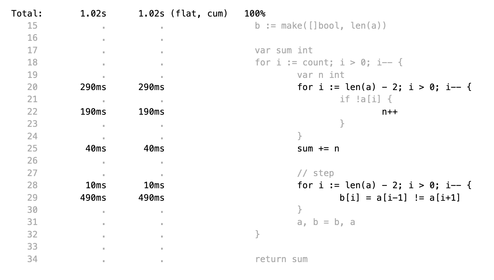

= Advent Of Code (AOC) 2016

My take on aoc puzzles in Go.

All puzzles live in the same Go package, usually one `.go` file per day.

I never make it to the board, because i am too slow.
I prefer to get my answers right the first time, use test cases, and do some
low level performance tweaking stuff.
More like NASA landing Rover on Mars, than trial and error.

All answers are hardcoded into the test cases.
Although most puzzles are user specific input, you might want to avoid looking
at the test cases.

== Day 1: No Time for a Taxicab

There's no grid, no 2D array, no X and Y variables, and no direction. Like.

Did not understand part 2, failing unit tests because i only marked end
positions. Only when i https://goplay.space[turtle graphic'ed] the example it
became clear that all steps count.

== Day 2: Bathroom Security
== Day 3: Squares With Three Sides
== Day 4: Security Through Obscurity

Part 2 needs to find sector ID of room "north pole objects". After finding
nothing, dumping all decrypted rooms, grep'ing for "north" one finally finds
the correct room "northpole object storage".

----
BenchmarkDay4Part1
BenchmarkDay4Part1-16                418           2771044 ns/op         1099945 B/op      12315 allocs/op
BenchmarkDay4Part2
BenchmarkDay4Part2-16             270402              4263 ns/op            1610 B/op         19 allocs/op
----

Use a 26 bytes array to count letter occurences instead of a sparse map[byte]uint:

----
BenchmarkDay4Part1
BenchmarkDay4Part1-16                854           1279735 ns/op          217994 B/op       6545 allocs/op
BenchmarkDay4Part2
BenchmarkDay4Part2-16             857664              1381 ns/op             336 B/op         11 allocs/op
----

Part #1 is 100% faster, part #2 300 % faster.

1381 nanoseconds (ns) are 1.4 microseconds (μs).
Light will travel around 500 meters in 1.6 μs.
I mean this is incredibly fast, nay?

Fastest reported times on reddit are 2 ms versus my 1.2 ms, but then those
numbers are from hardware that is at least 4 years older than my MacBook Pro
(16-inch, 2019, 2,4 GHz 8-Core Intel Core i9). I'm rolling my own parser
though, instead of using `scanf(3)` e.a.

== Day 5: How About a Nice Game of Chess?

----
BenchmarkDay5Part1
BenchmarkDay5Part1-16    	       1	8290784618 ns/op	1741396552 B/op	100409235 allocs/op
BenchmarkDay5Part2
BenchmarkDay5Part2-16    	       1	13266456586 ns/op	2739557288 B/op	157963381 allocs/op
----

Comparing the binary MD5 instead of the hex representation:

----
BenchmarkDay5Part1
BenchmarkDay5Part1-16    	       1	4014164864 ns/op	669773280 B/op	50204243 allocs/op
BenchmarkDay5Part2
BenchmarkDay5Part2-16    	       1	6278619828 ns/op	1053675720 B/op	78981141 allocs/op
----

Twice as fast,  `benchstat` reports:

----
name          old time/op    new time/op    delta
Day5Part1-16     8.29s ± 0%     4.01s ± 0%   ~     (p=1.000 n=1+1)
Day5Part2-16     13.3s ± 0%      6.3s ± 0%   ~     (p=1.000 n=1+1)

name          old alloc/op   new alloc/op   delta
Day5Part1-16    1.74GB ± 0%    0.67GB ± 0%   ~     (p=1.000 n=1+1)
Day5Part2-16    2.74GB ± 0%    1.05GB ± 0%   ~     (p=1.000 n=1+1)

name          old allocs/op  new allocs/op  delta
Day5Part1-16      100M ± 0%       50M ± 0%   ~     (p=1.000 n=1+1)
Day5Part2-16      158M ± 0%       79M ± 0%   ~     (p=1.000 n=1+1)
----

== Day 6: Signals and Noise
== Day 7: Internet Protocol Version 7
== Day 8: Two-Factor Authentication
== Day 9: Explosives in Cyberspace
== Day 10: Balance Bots
== Day 11: Radioisotope Thermoelectric Generators

Now this puzzle is way beyond my capabilities, types of generators do not
matter, never heard of Zobrist before, and the h() function for floors (1 * 
first floor, 2 * second floor, 3 * third floor, 4 * fourth floor) reminds me of
Columbus' egg: simple and easy after the fact.

== Day 12: Leonardo's Monorail
== Day 13: A Maze of Twisty Little Cubicles

Off by one for part 2, because 50 steps means the starting point and from then
on 50 steps.
I took the starting point as the first step.

== Day 14: One-Time Pad
== Day 15: Timing is Everything
== Day 16: Dragon Checksum

As a bit of surprise, this one was pretty straightforward, first shot ran in
half a second, so no further optimizations such as reducing allocations,
collapsing distinct reverse and flip phases into one e.a.

== Day 17: Two Steps Forward

Both part 1 and part 2 correct on first try.
Updated Go from 1.13 to 1.21 because it is October 2023.

== Day 18: Like a Rogue

Both part 1 and part 2 correct on first try.
Part 2 is the quickest coding of any puzzle i have ever done.
I basically just copied the test for part 1 into part 2, ran like a charm.

----
% go test -run=xxx -bench=Day18 -benchmem
goos: darwin
goarch: amd64
pkg: gitlab.com/jhinrichsen/adventofcode2016
cpu: Intel(R) Core(TM) i9-9980HK CPU @ 2.40GHz
BenchmarkDay18Part2-16    	       3	 373477125 ns/op	134400981 B/op	 1200004 allocs/op
PASS
ok  	gitlab.com/jhinrichsen/adventofcode2016	2.419
----

Let's see 373477125 ns/op = 373477 μs/op = 373 ms/op.
This is the base mark, now for the tuning.

=== Avoid allocations

Instead of

----
func next(row string) string
----

use an implementation that does not allocate:

----
func next(from []byte, into []byte)
----

We don't need the complete history, so we can take turns on predecessor and successors (a/b, blue/green).

Memory consumption is O(1) now:

----
BenchmarkDay18Part2V2-16    	       4	 274722198 ns/op	     224 B/op	       2 allocs/op
----

After having another look at the boolean expression `f(left, right)`
this is a regular XOR. Don't know why my online boolean simplifier did
not recognize this.
Maybe i should have done a Karnaugh myself. Gosh, `minterms`, long time
no see.

Runtime down by 70%:
----
name             old time/op    new time/op    delta
Day18Part2V2-16     275ms ± 0%      84ms ± 0%  -69.52%  (p=0.000 n=10+10)

name             old alloc/op   new alloc/op   delta
Day18Part2V2-16      224B ± 0%      224B ± 0%     ~     (all equal)

name             old allocs/op  new allocs/op  delta
Day18Part2V2-16      2.00 ± 0%      2.00 ± 0%     ~     (all equal)
----

These were the obvious low hanging fruits for tuning.
Let's have a look at pprof to identify more options.

----
(pprof) top10
Showing nodes accounting for 1.01s, 100% of 1.01s total
      flat  flat%   sum%        cum   cum%
     0.67s 66.34% 66.34%      0.68s 67.33%  gitlab.com/jhinrichsen/adventofcode2016.step (inline)
     0.32s 31.68% 98.02%      0.32s 31.68%  gitlab.com/jhinrichsen/adventofcode2016.SafesAndTraps.Safes (inline)
     0.01s  0.99% 99.01%      1.01s   100%  gitlab.com/jhinrichsen/adventofcode2016.Day18V2
     0.01s  0.99%   100%      0.01s  0.99%  runtime.asyncPreempt
         0     0%   100%      1.01s   100%  gitlab.com/jhinrichsen/adventofcode2016.BenchmarkDay18Part2V2
         0     0%   100%      0.93s 92.08%  testing.(*B).launch
----

One third is spent just counting bits.

----
100
101 func (a SafesAndTraps) Safes() int {
102         var n int
103         for i := len(a) - 2; i > 0; i-- {
104                 if !a[i] {
105                         n++
106                 }
107         }
108         return n
109 }
110
----

The assembler listing shows a whole lot of mumble jumble overhead going on under the hood.

----
0x0011 00017 (day18.go:100)	LEAQ	1(DX), SI
0x0018 00024 (day18.go:100)	TESTQ	BX, BX
0x001b 00027 (day18.go:100)	CMOVQNE	DX, SI
0x001f 00031 (day18.go:100)	MOVQ	SI, DX
0x0027 00039 (day18.go:103)	MOVQ	DX, AX
0x002a 00042 (day18.go:103)	RET
0x0000 00000 (day18.go:106)	TEXT	command-line-arguments.NewSafesAndTraps(SB), ABIInternal, $40-16
0x0000 00000 (day18.go:106)	CMPQ	SP, 16(R14)
0x0004 00004 (day18.go:106)	PCDATA	$0, $-2
0x0004 00004 (day18.go:106)	JLS	141
0x000a 00010 (day18.go:106)	PCDATA	$0, $-1
x000a 00010 (day18.go:106)	PUSHQ	BP
0x000b 00011 (day18.go:106)	MOVQ	SP, BP
0x000e 00014 (day18.go:106)	SUBQ	$32, SP
0x0012 00018 (day18.go:106)	FUNCDATA	$0, gclocals·wgcWObbY2HYnK2SU/U22lA==(SB)
0x0012 00018 (day18.go:106)	FUNCDATA	$1, gclocals·J5F+7Qw7O7ve2QcWC7DpeQ==(SB)
0x0012 00018 (day18.go:106)	FUNCDATA	$5, command-line-arguments.NewSafesAndTraps.arginfo1(SB)
0x0012 00018 (day18.go:106)	FUNCDATA	$6, command-line-arguments.NewSafesAndTraps.argliveinfo(SB)
0x0012 00018 (day18.go:106)	PCDATA	$3, $1
0x0012 00018 (day18.go:107)	MOVQ	BX, command-line-arguments.s+56(SP)
0x0017 00023 (day18.go:106)	MOVQ	AX, command-line-arguments.s+48(SP)
0x001c 00028 (day18.go:106)	PCDATA	$3, $-1
0x001c 00028 (day18.go:107)	LEAQ	2(BX), CX
0x0020 00032 (day18.go:107)	MOVQ	CX, command-line-arguments.bits.len+24(SP)
0x0025 00037 (day18.go:107)	LEAQ	type:bool(SB), AX
0x002c 00044 (day18.go:107)	MOVQ	CX, BX
0x002f 00047 (day18.go:107)	PCDATA	$1, $0
0x002f 00047 (day18.go:107)	CALL	runtime.makeslice(SB)
0x008d 00141 (day18.go:106)	PCDATA	$1, $-1
0x008d 00141 (day18.go:106)	PCDATA	$0, $-2
0x008d 00141 (day18.go:106)	MOVQ	AX, 8(SP)
0x0092 00146 (day18.go:106)	MOVQ	BX, 16(SP)
0x0097 00151 (day18.go:106)	CALL	runtime.morestack_noctxt(SB)
0x009c 00156 (day18.go:106)	MOVQ	8(SP), AX
0x00a1 00161 (day18.go:106)	MOVQ	16(SP), BX
0x00a6 00166 (day18.go:106)	PCDATA	$0, $-1
0x00a6 00166 (day18.go:106)	JMP	0
0x0017 00023 (day18.go:107)	MOVQ	BX, command-line-arguments.row+64(SP)
0x0021 00033 (day18.go:107)	LEAQ	2(BX), DX
0x0025 00037 (day18.go:107)	MOVQ	DX, command-line-arguments.bits.len+24(SP)
0x002b 00043 (day18.go:107)	LEAQ	type:bool(SB), AX
0x0032 00050 (day18.go:107)	MOVQ	DX, BX
0x0035 00053 (day18.go:107)	MOVQ	DX, CX
0x0038 00056 (day18.go:107)	PCDATA	$1, $0
0x0038 00056 (day18.go:107)	CALL	runtime.makeslice(SB)
0x007c 00124 (day18.go:107)	MOVQ	AX, command-line-arguments..autotmp_51+32(SP)
0x00d6 00214 (day18.go:100)	LEAQ	1(R9), R11
0x00dd 00221 (day18.go:100)	TESTQ	R10, R10
0x00e0 00224 (day18.go:100)	CMOVQNE	R9, R11
0x00e4 00228 (day18.go:100)	MOVQ	R11, R9
0x0026 00038 (day18.go:100)	LEAQ	1(AX), SI
0x002d 00045 (day18.go:100)	TESTQ	BX, BX
0x0030 00048 (day18.go:100)	CMOVQNE	AX, SI
0x0034 00052 (day18.go:100)	MOVQ	SI, AX
----

This overhead can also be seen in the pprof graph.

Un-exporting the struct and the function, and using a pointer receiver:

----
100
101 func (a *safesAndTraps) safes() int {
102         var n int
103         for i := len(*a) - 2; i > 0; i-- {
104                 if !(*a)[i] {
105                         n++
106                 }
107         }
108         return n
109 }
110
----

_increases_ the runtime by 5%.

----
name             old time/op    new time/op    delta
Day18Part2V2-16    83.9ms ± 0%    88.0ms ± 0%  +4.96%  (p=0.000 n=10+10)

name             old alloc/op   new alloc/op   delta
Day18Part2V2-16      224B ± 0%      224B ± 0%    ~     (all equal)

name             old allocs/op  new allocs/op  delta
Day18Part2V2-16      2.00 ± 0%      2.00 ± 0%    ~     (all equal)
----

Instead of guessing, have a look at what is going on inside the function.

The two main loops are for counting safes in the current row, and for determining
the next row from the current row. Obviously, the loop indices are the same.

Merging the two loops into one:

----
13 func Day18V3(row string, count int) int {
14         a := newTraps(row)
15         b := make([]bool, len(a))
16
17         var sum int
18         for ; count > 0; count-- {
19                 for i := len(a) - 2; i > 0; i-- {
20                         // count safes in current row
21                         if !a[i] {
22                                 sum++
23                         }
24                         // determine next row
25                         b[i] = a[i-1] != a[i+1]
26                 }
27                 a, b = b, a
28         }
29
30         return sum
31 }
----

Benchmark:
----
name             old time/op    new time/op    delta
Day18Part2V3-16    83.9ms ± 0%    65.1ms ± 0%  -22.38%  (p=0.000 n=10+10)

name             old alloc/op   new alloc/op   delta
Day18Part2V3-16      224B ± 0%      224B ± 0%     ~     (all equal)

name             old allocs/op  new allocs/op  delta
Day18Part2V3-16      2.00 ± 0%      2.00 ± 0%     ~     (all equal)
----

Nice, shaved another 25% off.

image::img/pprof.day18v3-2.png[after merging loops]

----
goos: darwin
goarch: amd64
pkg: gitlab.com/jhinrichsen/adventofcode2016
cpu: Intel(R) Core(TM) i9-9980HK CPU @ 2.40GHz
BenchmarkDay18Part2V1-16    	       3	 366501483 ns/op
BenchmarkDay18Part2V2-16    	      13	  83858027 ns/op
BenchmarkDay18Part2V3-16    	      18	  65084887 ns/op
PASS
ok  	gitlab.com/jhinrichsen/adventofcode2016	4.932s
----

== Day 19: An Elephant Named Joseph

Part 1 and 2 correct on first submission.
It had to be some sort of OEIS, because 3 million iterations doing _something_ already takes too long.
O(1), look mom, no allocs.

----
goos: darwin
goarch: amd64
pkg: gitlab.com/jhinrichsen/adventofcode2016
cpu: Intel(R) Core(TM) i9-9980HK CPU @ 2.40GHz
BenchmarkDay19Part1-16    	776810582	         1.544 ns/op	       0 B/op	       0 allocs/op
BenchmarkDay19Part1-16    	776542976	         1.543 ns/op	       0 B/op	       0 allocs/op
BenchmarkDay19Part1-16    	776042260	         1.543 ns/op	       0 B/op	       0 allocs/op
BenchmarkDay19Part1-16    	775742094	         1.543 ns/op	       0 B/op	       0 allocs/op
BenchmarkDay19Part1-16    	776205050	         1.544 ns/op	       0 B/op	       0 allocs/op
BenchmarkDay19Part1-16    	775785795	         1.544 ns/op	       0 B/op	       0 allocs/op
BenchmarkDay19Part1-16    	776457939	         1.543 ns/op	       0 B/op	       0 allocs/op
BenchmarkDay19Part1-16    	776107875	         1.543 ns/op	       0 B/op	       0 allocs/op
BenchmarkDay19Part1-16    	775791412	         1.544 ns/op	       0 B/op	       0 allocs/op
BenchmarkDay19Part1-16    	776528312	         1.543 ns/op	       0 B/op	       0 allocs/op
BenchmarkDay19Part2-16    	 2749078	       437.4 ns/op	       0 B/op	       0 allocs/op
BenchmarkDay19Part2-16    	 2748660	       436.5 ns/op	       0 B/op	       0 allocs/op
BenchmarkDay19Part2-16    	 2751550	       436.5 ns/op	       0 B/op	       0 allocs/op
BenchmarkDay19Part2-16    	 2747470	       436.0 ns/op	       0 B/op	       0 allocs/op
BenchmarkDay19Part2-16    	 2747382	       436.4 ns/op	       0 B/op	       0 allocs/op
BenchmarkDay19Part2-16    	 2756632	       436.3 ns/op	       0 B/op	       0 allocs/op
BenchmarkDay19Part2-16    	 2748680	       436.1 ns/op	       0 B/op	       0 allocs/op
BenchmarkDay19Part2-16    	 2747872	       436.5 ns/op	       0 B/op	       0 allocs/op
BenchmarkDay19Part2-16    	 2749844	       436.5 ns/op	       0 B/op	       0 allocs/op
BenchmarkDay19Part2-16    	 2746927	       436.3 ns/op	       0 B/op	       0 allocs/op
PASS
ok  	gitlab.com/jhinrichsen/adventofcode2016	30.260s
----

== Day 20: Firewall Rules

This is actually the way that IP subnet masks work. I checked the https://go.dev/src/net/ip.go?s=10884:10916[Go sources] for usable
implementations, but they focus on IPv4 and IPv6.

So after a little googling i found out that this is related to Leetcode's 201.
It is a solved problem for O(1) space and time complexity.
 
EDIT: Turned out i am on a wrong track, submasks is not going to solve the problem.
Falling back to a regular algo.

== Day 21: Scrambled Letters and Hash

This puzzle took me a while, but i ended up with a O(n) algorithm for both parts.
Correct on first submission for both parts.

----
goos: linux
goarch: amd64
pkg: gitlab.com/jhinrichsen/adventofcode2016
cpu: AMD Ryzen 5 3400G with Radeon Vega Graphics    
BenchmarkDay21Part2-8   	   10000	    107537 ns/op	   24888 B/op	     631 allocs/op
BenchmarkDay21Part2-8   	   11295	    106726 ns/op	   24888 B/op	     631 allocs/op
BenchmarkDay21Part2-8   	   10000	    103890 ns/op	   24888 B/op	     631 allocs/op
BenchmarkDay21Part2-8   	   11203	     99349 ns/op	   24888 B/op	     631 allocs/op
BenchmarkDay21Part2-8   	   10000	    103898 ns/op	   24888 B/op	     631 allocs/op
BenchmarkDay21Part2-8   	   10000	    109153 ns/op	   24888 B/op	     631 allocs/op
BenchmarkDay21Part2-8   	   11107	    102896 ns/op	   24888 B/op	     631 allocs/op
BenchmarkDay21Part2-8   	    9260	    110085 ns/op	   24888 B/op	     631 allocs/op
BenchmarkDay21Part2-8   	   12633	    107367 ns/op	   24888 B/op	     631 allocs/op
BenchmarkDay21Part2-8   	   15932	     76910 ns/op	   24888 B/op	     631 allocs/op
----

== Benchmarks

=== Go 1.16.6

----
go test -run NONE -bench . -benchmem
goos: darwin
goarch: amd64
pkg: gitlab.com/jhinrichsen/adventofcode2016
cpu: Intel(R) Core(TM) i9-9980HK CPU @ 2.40GHz
BenchmarkDay10Part1-16                	    7935	    149868 ns/op	  150914 B/op	     898 allocs/op
BenchmarkDay10Part2-16                	    5566	    180755 ns/op	  150906 B/op	     898 allocs/op
BenchmarkDay12Part1-16                	      16	  64670795 ns/op	35622124 B/op	  954128 allocs/op
BenchmarkDay12Part2-16                	       1	1880828079 ns/op	1033513760 B/op	27683214 allocs/op
BenchmarkDay13Part1-16                	   13106	     88480 ns/op	  145743 B/op	     505 allocs/op
BenchmarkDay14Part1-16                	      18	  61525941 ns/op	 3397745 B/op	   78431 allocs/op
BenchmarkDay15Part1PlainVanilla-16    	    3597	    341104 ns/op	       0 B/op	       0 allocs/op
BenchmarkDay15Part2PlainVanilla-16    	     216	   5890262 ns/op	       0 B/op	       0 allocs/op
BenchmarkDay1Part1-16                 	  125259	      8485 ns/op	    3082 B/op	       5 allocs/op
BenchmarkDay1Part2-16                 	   13448	     88505 ns/op	   49126 B/op	      51 allocs/op
BenchmarkDay2Part1-16                 	    9693	    118226 ns/op	     328 B/op	       2 allocs/op
BenchmarkDay2Part2-16                 	    8084	    131257 ns/op	     387 B/op	       3 allocs/op
BenchmarkDay3Part1-16                 	    5994	    208099 ns/op	   91296 B/op	    1902 allocs/op
BenchmarkDay3Part2-16                 	    5872	    208013 ns/op	   91296 B/op	    1902 allocs/op
BenchmarkDay4Part1-16                 	     914	   1284869 ns/op	  210504 B/op	    6545 allocs/op
BenchmarkDay4Part2-16                 	  808363	      1416 ns/op	     328 B/op	      11 allocs/op
BenchmarkDay5Part1-16                 	       1	3987839685 ns/op	669767480 B/op	50204193 allocs/op
BenchmarkDay5Part2-16                 	       1	6387133445 ns/op	1053682040 B/op	78981164 allocs/op
BenchmarkDay6Part1-16                 	  248094	      4243 ns/op	       8 B/op	       1 allocs/op
BenchmarkDay6Part2-16                 	  262150	      4339 ns/op	       8 B/op	       1 allocs/op
BenchmarkDay7Part1-16                 	    1296	    915176 ns/op	  735616 B/op	   14392 allocs/op
BenchmarkDay7Part2-16                 	     559	   2165888 ns/op	 1969477 B/op	   24375 allocs/op
BenchmarkDay8Part1-16                 	   31016	     38769 ns/op	    5648 B/op	     113 allocs/op
BenchmarkDay9Part1-16                 	   35505	     34320 ns/op	       0 B/op	       0 allocs/op
BenchmarkDay9Part2-16                 	   14134	     93560 ns/op	   98304 B/op	       1 allocs/op
PASS
----
